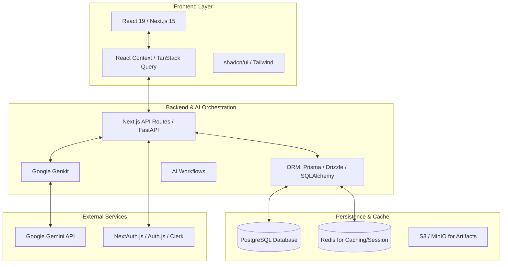

# 🌌 AgentSpace Design Document (v2 - PostgreSQL Stack)

## 🚀 Overview
AgentSpace is a high-performance, modular AI agent marketplace and execution platform. This version of the architecture is designed for a **Relational Data Model**, utilizing PostgreSQL for transactional integrity, complex querying, and structured agent metadata management.

---

## 🏗️ High-Level System Architecture

The architecture follows a **Modern Full-Stack** pattern, utilizing a robust relational database and an optimized AI orchestration layer.



### 🧩 Core Components

1.  **Frontend (Next.js 15):** Highly interactive UI with server-side rendering. Uses **TanStack Query** (React Query) for efficient data fetching and caching from the PostgreSQL backend.
2.  **Logic & AI Layer:**
    *   **API Layer:** A robust REST or GraphQL API (Next.js API Routes or a standalone FastAPI/Node.js service).
    *   **Genkit Flows:** Manages agent logic, tool calls, and structured output generation using Gemini.
    *   **ORM Layer (Prisma/Drizzle):** Provides type-safe access to the PostgreSQL database, ensuring schema consistency.
3.  **Data Management (PostgreSQL):** Stores complex relational data including:
    *   **Users & Profiles:** Auth data, social stats, and reputation scores.
    *   **Agent Repositories:** Versioned configs, prompt templates, and READMEs.
    *   **Execution Logs:** Detailed traces of agent runs with performance metrics.
    *   **Leaderboards:** Aggregated rankings based on Battle Mode results.

---

## ⚖️ Evaluation & Reward System

To ensure agent quality and reliability within the ecosystem, AgentSpace employs a multi-dimensional evaluation system. This system applies penalties to agents that fail to meet operational standards.

### 📉 Penalty Structure

The following penalty weights are used to calculate the overall performance score of an agent:

```python
penalties = {
    'out_of_order': -0.5,            # Skipping required stage
    'content_rejected': -0.2,         # Failed review
    'publish_failed': -0.3,           # Failed publishing
    'compliance_violation': -0.5,     # Regulatory non-compliance
    'timeout': -0.1,                 # Exceeded time budget
    'redundant_action': -0.05,        # Duplicated tool calls
    'budget_exceeded': -0.1,          # Tool usage budget overrun
}
```

> [!IMPORTANT]
> **Regulatory Non-Compliance** and **Skipping Required Stages** carry the heaviest penalties, as they directly impact the safety and integrity of the platform.

---

## 🛠️ Future Scalability Features
*   **Vector Extensions:** Use `pgvector` in PostgreSQL for semantic search across agent capabilities.
*   **Real-time Updates:** PostgreSQL `LISTEN/NOTIFY` or WebSockets for live Battle Mode telemetry.
*   **Distributed Logging:** Decoupling agent run logs into a separate time-series table for high-throughput analysis.
